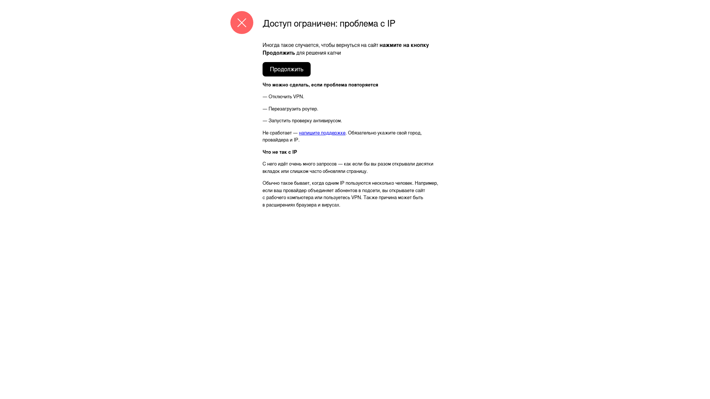

# Avito message socket System

## Requirements

1. Docker
2. NodeJS >= v22
3. Yarn (local dev)
4. Tunneling (https://cloudpub.ru/)

## Setup

1. `cp .env.example .env`
2. Put your Avito credentials and subscriber (`Рушан`) in `.env`:
```
AVITO_LOGIN=<login>
AVITO_PASSWORD=<password>
AVITO_SUBSCRIBER_NAME=<subscriber>
```
2. `yarn install` (skip if no need to test dependencies)
3. `docker compose up` or use make command `make run`

### Optional (use Cloudpub for tunneling) instead of local env
1. Setup cloudpub at https://cloudpub.ru
2. In terminal `./clo set token <token>`
3. In terminal `./clo login`
4. after starting docker run `./clo publish http 3000`

### Links
Backend port `9000`
Frontend port `5173`

1. Backend API (via Swagger) `http://localhost:9000/swagger`
2. Frontend `http://localhost:5173`

### Flow


### Logs from Cloudflared (Cloudpub)


### Some possible errors from Avito

This is a common problem in automation: sometimes avito temporary blocks IP due to often trigger auth


See screenshot logs in `./backend/logs` folder.

